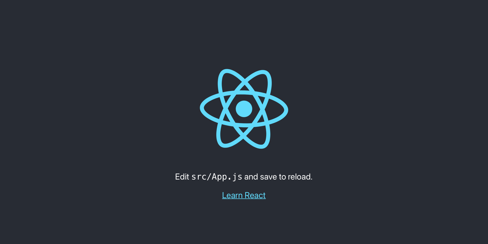

# React

React 是用于构建界面的 JavaScript 库。它具有渐进适配的特性，可以按需引入。

## React 工具链

一个完整的 React 工具链包含：

1. package 管理器：yarn 或 npm
2. 打包器：webpack 或 parcel
3. 编译器：Babel，能让新版 JavaScript 在旧版浏览器运行

## 创建 React 应用(Create React App)

Create React App 类似 Angular CLi，是一个脚手架。

Create React App 不会处理后端逻辑或操纵数据库，所以可以配合任何后端。其内部使用 Babel 和 webpack。

```
npx create-react-app my-app

cd my-app

npm start
```



React 默认端口是 3000，与 Angular 的 4200 不同。

代码被修改后会自动重新编译，和 Angular 一样。但是 Angular 会自动刷新网站，React 则不会。（暂不明白为什么）

开发好后，执行 npm run build 会在 build 文件夹内生成应用的最优版本。

# JSX

JSX 是 JavaScript 的语法扩展，与原生 JavaScript 等价。

## 为什么使用 JSX？

React 没有数据绑定。它将 UI 和逻辑一起存放到组件，让代码在视觉上更清晰，实现[关注点分离](https://zh.wikipedia.org/wiki/关注点分离)。

## 往 JSX 嵌入表达式

与 Angular 的单向数据绑定异曲同工：

```javascript
const name = "Klaus";
const element = <h1>Hello, {name}</h1>;
```

Angular 的单向数据绑定:

```typescript
// typescript
public name: string = 'Klaus';
```

```html
<!-- HTML -->
<h1>Hello, {{ name }}</h1>
```

React 的{}可以放置任何 JavaScript 表达式，比如：2 + 2，user.firstName 或 formatName(user)。

## JSX 也是表达式

因为是表达式，所以可以在语法中使用：

```jsx
function getGreeting(user) {
  if (user) {
    return <h1>Hello, {formatName(user)}!</h1>;
  }
  return <h1>Hello, Stranger.</h1>;
}
```

## JSX 属性驼峰式命名命名

```jsx
const element = <div tabIndex="0"></div>;
const element = </img>;
```

JSX 本质上并不是 HTML，内部的属性使用驼峰式命名，比如 HTML 的 tabindex，在这里是 tabIndex。

## JSX 引入图片

不能直接在 src 内添加 url。并且图片还不能放在 src 外面。

```jsx
import imgUrl from "./img/react-init.png";

</img>;
```

## JSX 可以防止注入攻击

可以安全地在 JSX 中插入用户输入内容：

```jsx
const title = response.Input;
const element = <h1>{title}</h1>;
```

因为React DOM 在渲染所有输入内容之前，默认会进行转义。它确保应用中不会注入并非自己明确编写的内容。所有内容在渲染之前都被转换成了字符串。这样可以有效地防止 [XSS（cross-site-scripting, 跨站脚本）攻击](https://zh.wikipedia.org/wiki/跨網站指令碼)。

# React元素

不管是 JSX：

```jsx
const element = {
  <h1 className="greeting">
    Hello, world!
  </h1>
};
```

还是 JavaScript 写的 React：

```jsx
const element = React.createElement(
  "h1",
  { className: "greeting" },
  "Hello, world!"
);
```

实际上是创建了这样一个对象（这是简化后的结构）：

```jsx
const element = {
  type: "h1",
  props: {
    className: "greeting",
    children: "Hello, world!",
  },
};
```

这些对象被称为 React 元素，React 通过读取这些对象来构建 DOM 并保持随时更新。

## 元素渲染

React 元素是创建开销极小的对象，与浏览器的 DOM 元素不同。

React DOM 负责更新 DOM 来与 React 元素保持一致。

### 根 DOM 节点

```html
<div id="root"></div>
```

该节点的内容都由 React DOM 管理。

类似 Angular 中的：

```html
<app-root></app-root>
```

仅使用 React 构建的应用一般只有一个根 DOM 节点。如果成型的网站引入React，可能包含多个。

通过 ReactDOM.render()，将 React 元素渲染到根 DOM 节点。

```jsx
const element = <h1>Hello, world!</h1>;
ReactDOM.render(element, document.getElementById("root"));
```
