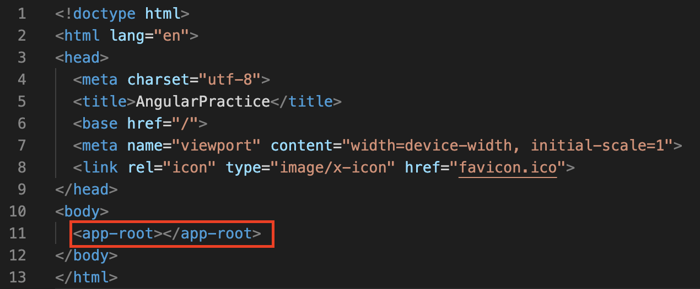
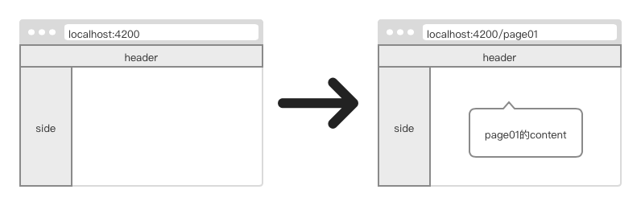

# Angular CLI

官方推荐使用 Angular CLI（脚手架）构建新项目。

首先安装 Angular CLI：

```
npm install -g @angular/cli
```

查看 Angular CLI 版本：

```
ng version
```

# 新建项目

使用 ng 指令创建 Angular 项目。

```
ng new angular-practice
```

新项目会有如下结构：


src 目录下会生成一个 app 组件：


它们分别是：

1. app-routing.module.ts 路由
2. app.component.css 样式
3. app.component.html 模版
4. app.component.spec.ts 单元测试文件
5. app.component.ts 组件文件
6. app.module.ts 配置文件

使用 ng 指令启动项目：

```
ng serve
```

映入眼帘的第一个画面就是 app.component.html

<div style="text-align:center"></div>

这样一个 angular 项目就创建好了

# 制作主页

Angular 是单页面应用，所有的操作和显示都在 index.html 在发生。它通过显示或隐藏特定组件来改变用户能看到的内容。画面之间的跳转，实质上是 HTML 页面内的内容替换。

<div style="text-align:center"></div>

index.html 内的\<app-root>\</app-root>会显示 app.component.html 的内容。即 app.component.html 是用户看到的第一个画面，并作为底层一直存在。

<div style="text-align:center"></div>

## 主页的设计

<div style="text-align:center"></div>
一般会把app component设置为空白画面，仅用于预加载可在全局生效的功能，然后通过配置路由将初始画面导向page01：

这样做的好处是，当未来想要更换初始画面时，不需要对 app component 再进行修改。

<div style="text-align:center"></div>

也有一些架构设计者会选择在 app.component.html 显示网站的 header 和 sidebar 等共通部件，仅在 content 中进行内容替换。

具体如何设计要根据情况而定。

# 新建工程目录

为了让目录更加清晰，建议将工程的其它组件和 app 组件分隔开。

1. 新建“business”文件夹。
2. 新建 PAGE01X 文件夹用于存放第一套连续的画面。


可以看到除了新建文件夹，还新建了两个 module 文件，它们分别是 business.module.ts 和 PAGE01X.module.ts。它们的前途会在下面说明。

# Angular 路由器

module 文件具有很多用途，最常见的用法是用于配置路由。路由器会把浏览器 URL 解释成改变视图的操作指南，以完成导航。

前面已经讲到 Angular 是一个单页面应用，页面的跳转实质上是组件的变换。为了让angular可以导向显示正确的组件，需要配置好路由。

为了让路由内的组件可以正确显示，还需要添加router-outlet这个标签。
## 第一步
首先在app-routing.module.ts里添加：
```javascript
const routes: Routes = [
  {
    path: 'business',
    loadChildren: () =>
      import('./business/business.module').then((m) => m.BusinessModule),
  },
];
```

这里放入两个参数：path和loadChildren。

path用于定义该导向的路由名称。这里定义了business，所以在网页上会显示成：localhost:4200/business。

同时，当url为”localhost:4200/business“时，angular会将路由导向BusinessModule所在的组件上。

loadchildren是angular/router提供的一个API，它可以返回一组要加载的路由。这里会将businessmodule目录下的路由全部返回。

## 第二步

因为在business内还新建了一个文件夹，所以导致路由又多了一个层级。需要在

## router-outlet

## 配置路由


相对路径：

"./"：代表目前所在的目录。

"../"：代表上一层目录。

以"/"开头：代表根目录。
