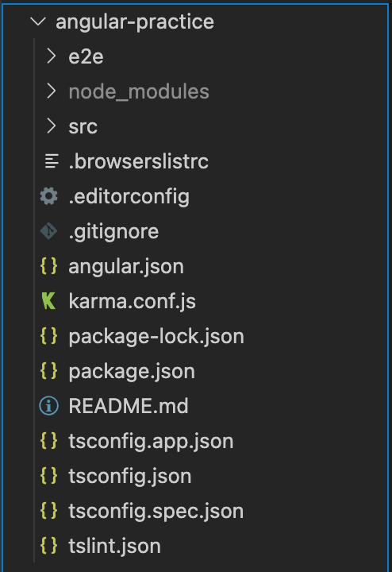
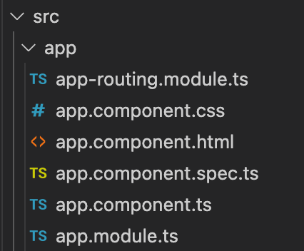
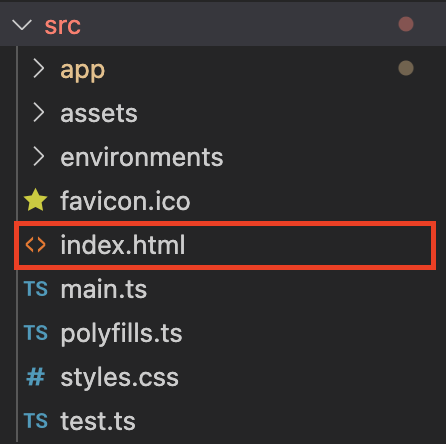
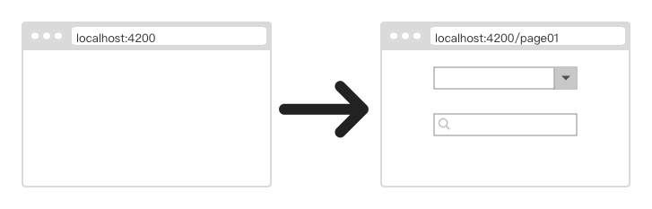
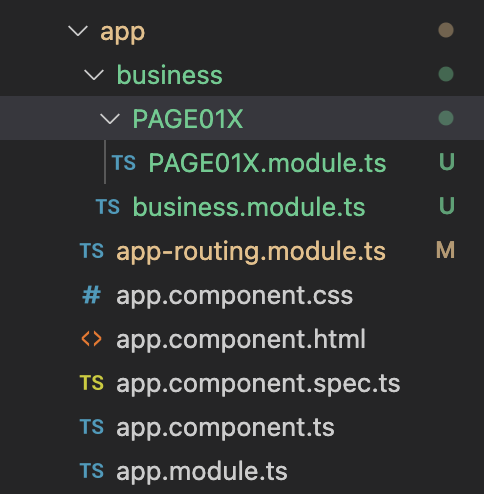

# Angular CLI

官方推荐使用Angular CLI（脚手架）构建新项目。

首先安装Angular CLI：
```
npm install -g @angular/cli
```

查看Angular CLI版本：
```
ng version
```

# 新建项目

使用ng指令创建Angular项目。
```
ng new my-app
```

这里，我使用如下指令
```
ng new angular-practice
```
新项目会有如下结构：



src目录下会生成一个app组件：



它们分别是：
1. app-routing.module.ts 路由
2. app.component.css 样式
3. app.component.html 模版
4. app.component.spec.ts 单元测试文件
5. app.component.ts 组件文件
6. app.module.ts 配置文件


使用ng指令启动项目：
```
ng serve
```
映入眼帘的第一个画面就是app.component.html

<div style="text-align:center"></div>

这样一个angular项目就创建好了

# 制作主页

Angular是单页面应用，所有的操作和显示都在index.html。通过显示或隐藏特定组件来改变用户能看到的内容。画面之间的跳转，实质上是HTML页面内的内容替换。

<div style="text-align:center"></div>


index.html内的\<app-root>\</app-root>会显示app.component.html的内容。即app.component.html是用户看到的第一个画面，并作为底层一直存在。

一般会把app component设置为空白画面，仅用于预加载可在全局生效的功能，然后通过配置路由将初始画面导向page01：

<div style="text-align:center"></div>


这样做的好处是，当未来想要更换初始画面时，不需要对app component再进行修改。

但是也有一些架构设计者会选择在app.component.html显示网站的header和sidebar等共通部件，仅在content中进行内容替换。

具体如何设计要根据情况而定。

## 新建工程目录

为了工程的其它组件和app组件分隔开，让目录更加清晰。我新建了business文件夹用于存放。

1. 新建“business”。
2. 在里面新建PAGE01X文件夹用于存放第一套连续的画面。



可以看到除了新建文件夹，我还新建了两个module文件，分别是business.module.ts和PAGE01X.module.ts。它们是干什么用的呢？我会在下面说明。

# Angular路由器

module文件具有很多用途，但是最常见的用法是用于配置路由。

在前面已经讲到Angular是一个单页面应用，页面的跳转实质上是组件的变换。但是如何让Angular知道按下某个按钮或触发某个事件时，可以显示正确的组件呢？这就需要在路由配置参数。

## router-outlet


因为index.html内的内容会一直显示，所以把它清空，只留下\<router-outlet>\</router-outlet>标签。

为了处理从一个画面到另一个画面的导航，需要使用Angular的Router（路由器）。路由器会把浏览器URL解释成改变视图的操作指南，以完成导航。

如此这般，组件才能被接入。

## 配置路由

使用ng指令生成的组件会被自动添加到app.module.ts
```typescript
@NgModule({
  declarations: [AppComponent, IndexComponent],
  imports: [BrowserModule, AppRoutingModule],
  providers: [],
  bootstrap: [AppComponent],
})
export class AppModule {}
```
不过还需要在app-routing.module.ts的routes里添加路径：
```typescript
const routes: Routes = [
  { path: 'index', component: IndexComponent },
];

@NgModule({
  imports: [RouterModule.forRoot(routes)],
  exports: [RouterModule],
})
export class AppRoutingModule {}
```

相对路径：

"./"：代表目前所在的目录。

"../"：代表上一层目录。

以"/"开头：代表根目录。