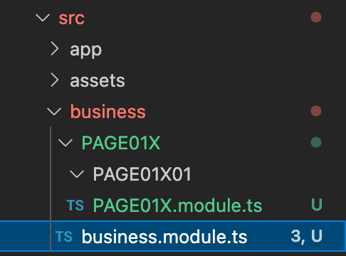

# Angular

Angular由组件构成，一个组件包含：
1. 一个HTML模版
2. 一个Typescript类
3. 一个CSS样式（可选）

# Angular Cli

创建组件需要Angular Cli（脚手架）。

安装Angular Cli：
```
npm install -g @angular/cli
```

查看Angular Cli版本：
```
ng version
```

# 初始化项目

使用ng指令创建Angular项目。
```
ng new my-app
```

这里，我使用如下指令
```
ng new angular-practice
```
生成的项目会有如下结构：


src目录下会生成一个app组件：


1. app-routing.module.ts 路由
2. app.component.css 样式
3. app.component.html 模版
4. app.component.spec.ts 单元测试文件
5. app.component.ts 组件文件
6. app.module.ts 配置文件


使用ng指令启动项目：
```
ng serve
```
映入眼帘的第一个画面就是app.component.html

<div style="text-align:center"></div>

# 制作主页

按照工业标准，不把app.component.html作为用户看到的第一个画面。（虽然它作为项目的根目录，是进入的第一个组件，这一般不会改变）。

一般会把app component设置为空白画面，仅用于预加载可在全局生效的功能。

采用如下结构：

<div style="text-align:center"></div>

用户一开始进入的的确是app component，随后立刻跳转到page01。因为这个过程很短而且app component画面又是空白的，用户会感觉自己首先进入的就是page01。

>这样做另一个好处是，当未来想要更换初始画面时，不需要对app component再进行修改。

## 新建index

使用ng指令新建组件：
```
ng generate component index
```

把app.component.html中的内容全部拷到index.component.html。

但是留下\<router-outlet>\</router-outlet>。这个在后面会说明。

<!-- ## 新建工程目录

新建business文件夹用于存放工程的其它组件。使其和app组件分隔开，让目录更加清晰。

1. 新建“business”。


2. 在里面新建PAGE01X文件夹用于存放第一套连续的画面，并新建business.module.ts和PAGE01X.module.ts。



这两个配置文件用来配置路由和声明Angular API。 -->

# Angular路由器

Angular是单页面应用，通过显示或隐藏特定组件的显示部分来改变用户能看到的内容。画面之间的跳转，实质上是HTML页面内标签的替换。

这个项目里，这个单一画面是angular-practice/src/index.html。

因为index.html内的内容会一直显示，所以把它清空，只留下\<router-outlet>\</router-outlet>标签。


为了处理从一个画面到另一个画面的导航，需要使用Angular的Router（路由器）。路由器会把浏览器URL解释成改变视图的操作指南，以完成导航。

如此这般，组件才能被接入。

## 配置路由

使用ng指令生成的组件会被自动添加到app.module.ts
```typescript
@NgModule({
  declarations: [AppComponent, IndexComponent],
  imports: [BrowserModule, AppRoutingModule],
  providers: [],
  bootstrap: [AppComponent],
})
export class AppModule {}
```
不过还需要在app-routing.module.ts的routes里添加路径：
```typescript
const routes: Routes = [
  { path: 'index', component: IndexComponent },
];

@NgModule({
  imports: [RouterModule.forRoot(routes)],
  exports: [RouterModule],
})
export class AppRoutingModule {}
```

# 创建页面（组件）

