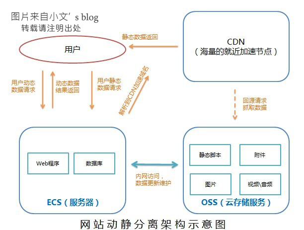

https://cloud.tencent.com/developer/article/1408323

# 动静分离

动静分离，就是指用 nginx 来处理用户端请求的静态页面，用 tomcat 来处理用户端请求的动态页面。
从而让动静页面在被访问时通过不同的容器来处理。

## 方法

将静态文件：图片，视频，音乐，JS，CSS，HTML 等可直接访问的文件等
单独存放在一个存储容器。

让服务器只需编译动态文件。这样就大大降低了服务器负载。
因为不用加载静态文件，所以降低了服务器带宽需求。

## 优点

1. 响应速度快
2. 服务器磁盘扩容费用高，而对象存储的费用很低。
3. 服务器和对象存储的流量费用也不同。

## 动静分离架构

架构由四个元素组成：用户、服务器、云存储、CDN

1.用户向服务器请求数据。 2.静态数据请求被服务器解析到 CDN 加速域名。CDN 向云存储获取静态数据后，返回给用户。 3.动态数据请求由服务器进行处理，返回被用户。 4.服务器通过内网更新云存储中的静态数据。
